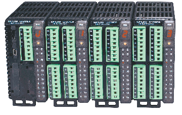
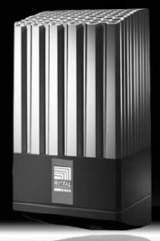

# MCS EQUIPMENT GENERAL DESCRIPTION

| **Requested by:**           | **Empresarios Agrupados** |
|-----------------------------|---------------------------|
| **Doc. Code:**              | 3151_MCS_0004             |
| **Editor:**                 | AO, PLG                   |
| **Approved by:**            |                           |

## Introduction

This document describes the characteristics of the hardware used in the Main Control System (MCS).

## Technical description of the hardware used in the MCS

This chapter briefly describes the components followed by a table with its main characteristics. Components are
organized by function: distributed I/O, heaters, switches...

### Switches

#### Ethernet Switch: CISCO IE-3000 8TC

The Cisco® Industrial Ethernet 3000 (IE3000) is a switch that provide a secure switching infrastructure for harsh environments.

##### 3000 Switch Technical details

| **Specification** |
|-----|
| 8 Ethernet 10/100 ports and 2 Dual-Purpose Uplinks (Each Dual Purpose Uplink port has one 10/100/1000 Ethernet Port and one SFP based Gigabit Ethernet port, one port active) |
| Each switch supports two (2) Cisco IE3000-8FE modules, one (1) Cisco IE3000-8FX module, or one (1) Cisco IE3000-8FE module and one (1) Cisco IE3000-8FX module |

| **Performance**                                            |
|-----|
| Wire-speed switching                                       |
| 128 MB DRAM                                                |
| 64 MB Flash memory                                         |
| Configurable up to 8000 MAC addresses                      |
| Configurable up to 255 IGMP groups                         |
| Configurable maximum transmission unit (MTU) of up to 9000 bytes, with a maximum Ethernet frame size of 9018 bytes (Jumbo frames) for bridging on Gigabit Ethernet ports, and up to 1998 bytes for bridging of Multi-protocol Label Switching (MPLS) tagged frames on both 10/100 and 10/100/1000 ports |

| **Power Consumption**                                      |                                      |
|-----|-----|
| Maximum power consumption               |  31 W                                |
| Input Voltage and Currents supported    |  18-60VDC, (Cisco IE3000-4TC and Cisco IE3000-8TC)  85-265VAC/88-300VDC, 1.3-0.8A, 50-60 Hz (with addition of Cisco IE3000-PWR)    |
| Power Rating                            | 0.05 kVA                             |
|  **Environmental data**                 |                                      |
| Operating temperature                   | -40 to 70 ºC                         |
| Storage temperature                     | -25 to 70 ºC                         |
| Operating relative humidity             | 10 to 95% (condensing)               |
| Operating altitude                      | Up to 3049 m                         |
| Storage altitude                        | Up to 4573 m                         |
| **Mechanical Data**                     |                                      |
| Dimensions   |          |
|  Height      | 152 mm   |
|  Width       | 147 mm   |
|  Height      | 112 mm   |
| Weight       | 3.6 kg   |
| **Standards and Certifications**   |                                      |
| Standard safety certifications     | UL to UL 60950, Third Edition C-UL to CAN/CSA C22.2 No. 60950-00, Third Edition TUV/GS to EN 60950:2000 CB to IEC 60950 with all country deviations NOM to NOM-019-SCFI CE Marking |
| Industrial safety certifications   | UL 508 CSA 22.2 / 142 EN60204-1 EN61010-1 EN61131-2 EN61140                          |
| Mechanical stability               | Shock—15g (Operational), 30g (Nonoperational)                                        |
| EMC Interface Immunity             | IEC61000-4-2 [Criteria A—Class 2] IEC61000-4-3/ENV50204 [Criteria A] IEC61000-4-4 [Criteria A / Criteria B] IEC61000-4-5 [Criteria B] IEC61000-4-6 [Criteria A]                    |
| Standard Electromagnetic Emissions Certifications          | FCC Part 15 Class A EN 55022: 1998 (CISPR22) EN 55024: 1998 (CISPR24) VCCI Class A AS/NZS 3548 Class A CE CNS 13438 Class A MIC    |
| Industrial Electromagnetic Emissions Certifications        | EN 50081-2 EN 50082-2 EN 61131-2 EN 61326-1 CISPR11                                  |
| Industry Specifications                                    | EC 61850-3 (Substations)  IEEE1613 (Substations)  NEMA TS-2 (ITSs)  EN50155 (Railway)  ODVA Common Industrial Protocol  IEEE 1588v2  PROFINET IO                                   |
| Hazardous Locations                                        | UL 1602 Class 1, Div 2 A-D CSA 22.2 / 213 Class 1, Div 2 A-D IEC 60079-15 EN 50021—Class 1, Zone 2                                 |
| **Mean time between failures**          |                                      |
| Time                                    | 338801 hours                         |

##### Ethernet Switch extension: CISCO IEM-3000 8TMC

Expansion copper Module for Cisco IE-3000-4TC, IE-3000-8TC, IE-3000-4TC-E, and IE-3000-8TC-E switches, eight 10/100 TX ports.

#### Ethernet Switch: CISCO IE-3200 8T2S_E

The Cisco Catalyst® IE3200 Rugged Series ushers in mainstream adoption of Gigabit Ethernet connectivity in a compact
form factor for a wide variety of extended enterprise and industrial applications.

##### 3200 Switch Technical details

| Features               |                                                  |
|------------------------|--------------------------------------------------|
| Forwarding rate        | Line rate for all ports and all packet sizes     |
| Number of queues       | 8                                                |
| Unicast MAC addresses  | 8K                                               |
| Internet Group Management Protocol (IGMP) multicast groups | 1K           |
| No. of VLANs           | 256                                              |
| Spanning Tree Protocol (STP) instances | 128                              |
| Access Control Entries (PACL/VACL/RACL)| 3K                               |
| DRAM                   | 2 GB                                             |
| Flash (User Accessible)| 1.5 GB                                           |
| SD card capacity1      | 4 GB                                             |
| Jumbo Frames           | 8996 bytes                                       |

### Cabinet Temperature control system

#### Controller: Watlow RMC

Technical details are general data of RMC family

Module for thermal system management. It contains multiple temperature inputs, PID or on/off control loop & high ampere
power output options.

##### Watlow Controller Technical details

| **Inputs**                           |                                  |
|--------------------------------------|----------------------------------|
| Universal input                      |                                  |
|  Type                                | **Thermocouple, grounded or ungrounded sensor.**  **RTD 2 or 3 wire, platinum, 100 and 1000 Ω** **Potentiometer: 0 to 1200 Ω** |
|  Input impedance                     | **\> 20 MΩ**                     |
|  Source resistance                   | **Max. of 2 kΩ**                 |
|  Process                             | **0 – 20 mA @ 100 Ω or 0 – 10 V DC @ 20kΩ input impedance**                    |
|  Current range                       | **0 – 50 mA @ 100 Ω input impedance**                                          |
|  Response time                       | **1 s max., accuracy ±1 mA typical**                                           |
| Thermistor Input                     |                                  |
|  Input range                         | **0 to 40 kΩ, 0 to 20 kΩ, 0 to 10 kΩ, 0 to 5 kΩ**                              |
|  Linearization curve                 | **Built – in**                   |
| Digital input                        |                                  |
|  Update rate                         | **10 Hz**                        |
|  Max. voltage                        | **36 V DC @ 3 mA**               |
|  Min. high state                     | **3 V @ 0.25 mA**                |
|  Max. low state                      | **2 V**                          |
| Dry Contact Input                    |                                  |
|  Update rate                         | **10 Hz**                        |
|  Min. open resistance                | **10 kΩ**                        |
|  Max. closed resistance              | **50 Ω**                         |
|  Max. short circuit                  | **13 mA**                        |
| **Calibration Accuracy**             |                                  |
| Accuracy and sensor conformity       | **±0.1% of span, ±1ºC @ calibrated ambient Tº & line voltage**                 |
|  Type R, S, B                        | **0.2%**                         |
|  Type T below -50ºC                  | **0.2%**                         |
| Calibration ambient temperature      | **25ºC (±3ºC)**                  |
| Accuracy span                        | **540ºC min**                    |
| Temperature stability                | **±0.1ºC/ºC change in ambient**  |
| **Environmental data**               |                                  |
| Operating Temperature                | **-18 – 65ºC**                   |
| Storage Temperature                  | **-40 – 85ºC**                   |
| Ambient Relative Humidity            | **0 – 90%, non condensing**      |
| **Environmental data**               |                                  |
| Operating Temperature                | **-18 – 65ºC**                   |
| Storage Temperature                  | **-40 – 85ºC**                   |
| Ambient Relative Humidity            | **0 – 90%, non condensing**      |
| **Electrical data**                  |                                  |
| Module's supply voltage              | **20.4 to 30.8 V AC/DC, 50/60 Hz**                                             |
| Voltage tolerance                    | **-5% / +5%**                    |
| External supply requirements         | **Class 2 or SELV rating**       |
| Power consumption                    | **7 W, 14 VA**                   |
| **Mechanical Data**                  |                                  |
| Installation                         | **DIN-rail mounting**            |

| **Standards and Certifications**     |
|----|
| **UL®/EN 61010 Listed, C-UL® C22.2 \#61010ANSI/ISA 12.12.01-2007 Class 1, Div. 2-Group A, B, C, D temperature code T4 (optional)** |
| **UL® 1604 Class 1, Div. 2 (optional)** |
| **EN 60529 IP20** |
| **UL® 50, NEMA 4X, EN 60529 IP66; 1/16 DIN remote user interface (RUI)** |
| **CSA 610110 CE** |
| **FM Class 3545 on limit control versions** |

#### Communication module: Watlow RMA A3

This module adds fieldbus protocols, memory and data logging to the RMC.

##### Watlow communication Technical details

| **General Data**                |                                                   |
|---------------------------------|---------------------------------------------------|
| Maximum system configuration    | **One RMA with up to 16 RM modules**              |
| Memory card                     | **Removable micro SD physical size**              |
| Data logging                    | **Storage in micro SD, CSV file type**            |
|  **Peripheral port**            |                                                   |
| Serial standard bus             | **Yes**                                           |
| EIA 232/485 Modbus RTU          | **Optional**                                      |
| Ethernet/IP, Modbus TCP         | **Optional**                                      |
| DeviceNET                       | **Optional**                                      |
| Profibus DP                     | **Optional**                                      |
| USB                             | **Optional (mass storage)**                       |
| **Environmental data**          |                                                   |
| Temperature                     |                                                   |
|  Operating temperature          | **-18 – 65 ºC**                                   |
|  Storage temperature            | **-40 – 85 ºC**                                   |
| Relative humidity               | **0 – 90%, non condensing**                       |
| Fire/Shock                      | **Rail mount modules need to be installed in fire/shock protection enclosures, such as NEMA 1 type unless all connections are class 2 or SELV** |
| **Electrical data**             |                                                   |
| Voltage supply range            | **20.4 – 30.8 V (AC/DC), ±5%**                    |
| Power                           | **4 W, 9 VA**                                     |
| **Mechanical data**             |                                                   |
| Dimensions                      |                                                   |
|  Length                         | **147 mm**                                        |
|  Width                          | **52 mm**                                         |
|  Height                         | **116 mm**                                        |
| Housing                         | **IP 20**                                         |

| **Standards and Certifications** |
|----|
| **UL/EN 61010; c_UL C22.2 \#61010** |
| **ANSI/ISA 12.12.01-2007 Class 1, Div. 2-Group A, B, C, D Temperature code T4** |
| **EN 60529 IP20** |
| **FM Class 3545** |
| **UL 50, Type 4X indoor use**|

### Mount Control Computer

For the MCC a Simatic IPC847D industrial computer is used, with the following characteristics:

| **General Data**                         |                           |
|------------------------------------------|---------------------------|
| Order Number                             | 6AG4114-2ND30-0XX6        |
| Processors and Mainboards:               | Xeon E3-1275 v3 (4C/8T, 3.5(3.9) GHz, 8MB Cache, TB, VT-x, VT-d, AMT; 2x Gbit Ethernet, 2x DisplayPort, 1xDVI-I , 2x USB 3.0 rear, 2x USB 2.0 rear, 1x USB 3.0 front, 2x USB 2.0 front, 1x USB 3.0 internal, 1x COM1; |
| Drives (SATA):                           | RAID1, 1 TB (2x 1 TB HDD, data mirroring); Internally mounted, 0.5g Vibration, 5g shock |
| Main Memory:                             | 8 GB DDR3 SDRAM (2x 4 GB), dual channel; |
| Ethernet                                 | 2 × Ethernet interface (RJ-45) Ethernet 1: WGI217LM, AMT-capable 6, supports jumbo frames up to 9014 bytes Ethernet 2: Intel WGI210IT, supports jumbo frames up to 9014 bytes |
| Type of Housing and Exchangeable Media:  | Housing painted;          |
| Extensions (Hardware):                   | 1xCoOM (RS232, 9-pin), graphics onboard; |
| Country-specific types / Power Supplies: | 2x 110/230V Redundant power supply       |

This PC runs on CentOS 7 64bits operating system and LabVIEW will be used for the EUI.

### PXIs

#### Chassis: NI PXIe-1086

The NI PXIe-1086 is a 18-slot chassis with PXI Express platform. It incorporates hot-swappable, redundant AC power
supplies as well as hot-swappable, front-accessible, redundant cooling fans.

##### NI PXIe-1086 Technical details

| **General Data**                                    |                                      |
|-----------------------------------------------------|--------------------------------------|
| Number of slots                                     | **18**                               |
| PXI bus type                                        | **PXI Express** **PXI Hybrid Compatible** |
| Number of hybrid peripheral slots                   | **16**                               |
| Maximum system bandwidth                            | **12 GB/s**                          |
| Compatible with 3U PXI & CompactPCI modules         | **Yes**                              |
| Optional front or rear rack mountable               | **Yes**                              |
| Integrated controller                               | **No**                               |
| **Electrical Data**                                 |                                      |
| Total available power                               | **855 W**                            |
| Input voltage range                                 | **100 V – 240 V AC**                 |
| Input frequency range                               | **47 Hz – 63 Hz**                    |
| Field-replaceable power supply                      | **Yes**                              |
| Remote power inhibit control and voltage monitoring | **Yes**                              |
| DC output                                           | **+3.3 V, max. 50 A (single), 60 A (dual)** **+5 V, max. 40 A (single), 49 A (dual)** **+12 V, max. 50 A (single), 62 A (dual)** **-12 V, max. 4 A (single), 4 A (dual)** **+5 Vaux, max. 1.5 A (single), 1.5 A (dual)** |
| **Cooling Data**                                    |                                      |
| Auto fan                                            |                                      |
|  Sound pressure level                               | **57 dBA**                           |
|  Sound power                                        | **63.3 dBA**                         |
| High fan                                            |                                      |
|  Sound pressure level                               | **69 dBA**                           |
|  Sound power                                        | **79.3 dBA**                         |
| Auto/High fan selector                              | **Yes**                              |
| Number of fans                                      | **6**                                |
| **Environmental data**                              |                                      |
| Vibration **IEC-60068-2-27 & IEC-60068-2-64**       |                                      |
|  Operational shock                                  | **30 g**                             |
|  Random vibration                                   | **5 – 500 Hz, 0.3 g**                |
| Temperature **IEC-60068-2-1 & IEC-60068-2-2**       |                                      |
|  Operating temperature                              | **0 – 50 ºC**                        |
|  Storage temperature                                | **-40 – 71 ºC**                      |
| Humidity **IEC-60068-2-56**                         |                                      |
|  Operating relative humidity                        | **5 – 95 %**                         |
|  Storage relative humidity                          | **5 – 95 %**                         |
| Max. altitude                                       | **4600 m**                           |
| **Mechanical data**                                 |                                      |
| Dimensions                                          |                                      |
|  Length                                             | **476.5 mm**                         |
|  Width                                              | **467.1 mm**                         |
|  Height                                             | **268.7 mm**                         |
| Weight                                              |                                      |
|  One power supply                                   | **14.3 kg**                          |
|  Dual power supply                                  | **17.1 kg**                          |
| **Standards and Certifications**                    |                                      |
| Safety                                              | **IEC 61010-1, EN 61010-1** **UL 61010-1, CSA 61010-1**                            |
| EMC | **EN 61326-1 (IEC 61326-1): Class A emissions;**  **EN 55011 (CISPR 11): Group 1, Class A emissions** **AS/NZS CISPR 11: Group 1, Class A emissions** **FCC 47 CFR Part 15B: Class A emissions** **ICES-001: Class A emissions** |

#### Chassis: NI PXIe-1071

The NI PXIe-1071 combines a 4-slot PXI Express backplane with a structural design optimized for maximum usability in a
wide range of applications.

##### NI PXIe-1071 Technical details

| **Chassis Cooling**            |                                      |
|--------------------------------|--------------------------------------|
| Per slot cooling capacity      | 38.25 W                              |
| Module cooling system          | Forced air circulation (positive pressurization) through a 150 CFM fan with High/Auto speed selector|
| Slot airflow direction         | Bottom of module to top of module    |
| Module cooling intake          | Bottom of chassis                    |
| Module cooling exhaust         | Right side, rear, and top of chassis |
| Power supply cooling system    | Forced air circulation through integrated fan |
| Power supply cooling intake    | Front and left side of chassis       |
| Power supply cooling exhaust   | Rear of chassis                      |
| **Environmental**              |   |
| Maximum altitude               | 2,000 m (800 mbar) (at 25 °C ambient)|
| Measurement Category           | II                                   |
| Pollution Degree               | 2                                    |
| For indoor use only            |                                      |
| **Operating Environment**      |  |
| Ambient temperature range      | 0 to 50 °C (Tested in accordance with IEC-60068-2-1 and IEC-60068-2-2. Meets MIL-PRF-28800F Class 3 low temperature limit and MIL-PRF-28800F Class 2 high temperature limit.)|
| Relative humidity range        | 20 to 80%, non-condensing (Tested in accordance with IEC-60068-2-56.)
| **Shock and Vibration**        |  |
|Operational shock               | 30 g peak, half-sine, 11 ms pulse (Tested in accordance with IEC-60068-2-27. Meets MIL-PRF-28800F Class 2 limits.)|
| Random Vibration               |  |
| Operating                      | 5 to 500 Hz, 0.3 g_rms|
| Non-operating                   | 5 to 500 Hz, 2.4 g_rms (Tested in accordance with IEC-60068-2-64. Non-operating test profile exceeds the requirements of MIL-PRF-28800F, Class 3.)|

#### CPU: NI PXIe-8880

High-performance Intel Xeon E5-2618L v3 processor-based embedded controller for use in PXI Express systems. With the
2.3 GHz base frequency (3.4 GHz single-core, Turbo Boost mode) eight-core processor with up to 16 hyper threaded virtual
cores and the triple-channel 1866 MHz DDR4 memory, this controller is ideal for processor-intensive RF, modular
instrumentation, and DAQ applications.

##### NI PXIe-8880 Technical details

| **General Data**                              |                                                          |
|-----------------------------------------------|----------------------------------------------------------|
| Controller type                               | **Embedded**                                             |
| PXI bus type                                  | **PXI Express**                                          |
| CPU                                           | **Intel Xeon ES-2618L**                                  |
| CPU clock frequency                           | **2.3 GHz (base), 3.4 GHz (single-core Turbo)**          |
| Number of cores                               | **8**                                                    |
| Memory                                        | **8 GB (standard), 24 GB (max)**                         |
| Solid-State drive                             | **24 B or larger serial ATA**                            |
| Operating system                              | **Windows 7**                                            |
| Required slots                                | **4**                                                    |
| **Peripheral port**                           |                                                          |
| Ethernet                                      | **1000BaseT, 2 ports**                                   |
| GPIB (IEEE 488.2) Interface                   | **Yes**                                                  |
| Serial ports (RS232)                          | **No**                                                   |
| Parallel                                      | **No**                                                   |
| USB                                           | **2.0 = 4, 3.0 = 2**                                     |
| **Electrical Data**                           |                                                          |
| Power                                         | **+3.3 V, typ. 2.24 A, max. 2.96 A** **+5 V, typ. 2.44 A, max. 3.11 A** **+12 V, typ. 6.5 A, max. 8.7 A** **+5 Vaux, typ. 0.19 A, max. 0.23**          |
| **Environmental data**                        |                                                          |
| Vibration **IEC-60068-2-27 & IEC 60068-2-64** |                                                          |
|  Operational shock                            | **30 g**                                                 |
|  Random vibration                             |                                                          |
|  Operating                                    | **5 – 500 Hz, 0.3 g**                                    |
|  Non-operating                                | **5 – 500 Hz, 2.4 g**                                    |
| Temperature **IEC-60068-2-1 & IEC-60068-2-2** |                                                          |
|  Operating temperature                        | **0 – 50 ºC**                                            |
|  Storage temperature                          | **-40 – 71 ºC**                                          |
| Humidity **IEC-60068-2-56**                   |                                                          |
|  Operating relative humidity                  | **10 – 90 %**                                            |
|  Storage relative humidity                    | **5 – 95 %**                                             |
| Maximum altitude                              | **2000 m**                                               |
| **Mechanical data**                           |                                                          |
| Dimensions                                    | **Four-wide 3U PXI Express module**                      |
| Weight                                        | **1.5 kg**                                               |
| **Standards and Certifications**              |                                                          |
| Safety                                        | **IEC 61010-1, EN 61010-1** **UL 61010-1, CSA 61010-1**  |
| EMC                                           | **EN 61326-1 (IEC 61326-1): Class A emissions** **EN 55011 (CISPR 11): Group 1, Class A emissions** **EN 55022 (CISPR 22): Class A emissions** **EN 55024 (CISPR 24): Immunity** **AS/NZS CISPR 11: Group 1, Class A emissions** **AS/NZS CISPR 22: Class A emissions** **FCC 47 CFR Part 15B: Class A emissions** **ICES-001: Class A emissions** |

#### Dual Ethernet Port: NI PXIe-8234

Based on the Intel 82572EI gigabit controller.

##### Technical details

| **General Data**                              |                                                     |
|-----------------------------------------------|-----------------------------------------------------|
| Product family                                | **Frame grabbers**                                  |
| Form factor                                   | **PXI / PXI Express**                               |
| PXI bus type                                  | **PXI Express** **PXI Hybrid Compatible**           |
| Camera interface                              | **GigE Vision**                                     |
| Operating system                              | **Windows**                                         |
| Required slot                                 | **1, supporting a x4 PCI connection**               |
| **Smart Camera**                              |                                                     |
| Industrial protocol support                   | **Ethernet / IP** **Modbus / TCP** **TCP / IP**     |
| Number of camera input ports                  | **2**                                               |
| **Peripheral port**                           |                                                     |
| Ethernet                                      |                                                     |
|  Interface                                    | **2 x 10P10C modular jack**                         |
|  Signaling                                    | **1000Base-T**                                      |
| **Environmental data**                        |                                                     |
| Temperature **IEC-60068-2-1 & IEC-60068-2-2** |                                                     |
|  Operating temperature                        | **0 – 55 ºC**                                       |
|  Storage temperature                          | **-40 – 70 ºC**                                     |
| Humidity **IEC-60068-2-56**                   |                                                     |
|  Operating relative humidity                  | **10 – 90 %, non condensing**                       |
|  Storage relative humidity                    | **5 – 95 %, non condensing**                        |
| Max. altitude                                 | **2000 m**                                          |
| **Electrical Data**                           |                                                     |
| Power                                         | **3.3 V, typ. 0.375 A** **5 V, typ. 0.36 A** **1.8 V, typ. 1.19 A** **5.2 W max.**                |
| **Mechanical data**                           |                                                     |
| Dimensions                                    |                                                     |
|  Length                                       | **160 mm**                                          |
|  Width                                        | **100 mm**                                          |
| Weight                                        | **158 g**                                           |
| **Standards and Certifications**              |                                                     |
| Safety                                        | **IIEC 60950-1, EN 60950-01**  **UL 60950-1, CSA 60950-1** |
| EMC                                           | **EN 61326 EMC requirements; Minimum Immunity** **EN 55011 Emissions; Group 1, Class A** **CE, C-Tick, ICES, and FCC Part 15 Emissions; Class A** |

#### Beckhoff Industrial PC C5210-0040

The C5xxx Industrial PCs series is designed for 19-inch slide-in installation. They are equipped with maximum performance
class components and are ideally suited for machine construction and plant engineering applications, for example with
the TwinCAT automation software.

>In the MCS this device is not using TwinCAT, instead it's running the same Linux RT software that the NI PXIs.

##### Beckhoff c5210-0040 Technical details

| Technical data            | C5210-0040                                                            | Options             |
|---------------------------|-----------------------------------------------------------------------|---------------------|
| Device type               | 19-inch slide-in Industrial PC                                        |                     |
| Housing                   | stainless steel based housing, 1 high units, with lockable front flap |                     |
| Front flap                | lockable, includes 2 x USB 2.0, reset key and ATX key|DVD drive       |                     |
| Slots for hard disk/flash | 2 removable frames for hard disks                                     | removable frames for SSDs |
| Protection rating         | IP20                                                                  |                     |
| Operating temperature     | 0…55 °C                                                               |                     |
| Dimensions (W x H x D)    | 482.7 x 44 x 493.8 mm (19" x 1.7" x 19.44"), depth behind front 475 mm (18.7")                              |   |
| Processor                 | Intel® Celeron® G4900 3.1 GHz, 2 cores (TC3: 50)                      | up to Intel® Core™ i7-9700TE 1.8 GHz, 8 cores (TC3: 80) |
| Motherboard               | 3½-inch motherboard for 8th/9th generation Intel® Celeron®, Pentium®, Core™ i3/i5/i7                        |   |
| PCIe/PCI slots            | 2 PCIe module slots to plug-in Beckhoff PCIe modules or to led out interfaces of the motherboard ex factory |   |
| Interfaces                | 4 x USB 3.1 Gen. 1, 1 x RS232 at the rear, 2 x USB 2.0 behind the front flap, 1 x DVI                       |   |
| Memory                    | 4 GB DDR4 RAM                                                         | up to 64 GB DDR4 RAM|
| Graphic adapter           | integrated in the processor                                           |                     |
| Ethernet                  | 2 x 100/1000BASE-T on-board                                           |                     |
| RAID                      | on-board SATA RAID 1 controller                                       |                     |
| Hard disks/flash          | hard disk, 3½-inch, 1 TB                                              | hard disk up to 4 TB, SSD|
| Disk drive                | –                                                                     | multi DVD           |
| Power supply              | 100…240 V AC                                                          | 24 V DC, UPS        |
| Operating system          | –                                                                     | Windows 10 IoT Enterprise, Windows Server 2019 |

##### MCS specific configuration (C5210-0040 / 000236301)

| Technical data            | C5210-0040 / 000236301                                                       |
|---------------------------|------------------------------------------------------------------------------|
| Hard disks/flash          | solid-state disk SSD, 3D flash, 2½-inch, 240 GB,instead of 3½-inch hard disk |
| Processor                 | processor 9th generation Intel® Core™ i7-9700TE, 1.8 GHz, 8 cores (TC3:80), instead of Intel® Celeron® G4900 3.1 GHz (TC3:50) |

### cRIO System

#### EtherCat expansion chassis: NI 9144

The NI 9144 is an 8-slot rugged EtherCAT slave chassis for adding deterministic, distributed I/O to NI EtherCAT master
controllers. With standard CAT 5 Ethernet cabling, it communicates deterministically with any NI CompactRIO, real-time
PXI, or real-time industrial controller that has two Ethernet ports. You can daisy chain multiple NI 9144 slave chassis
from the master controller to expand time-critical applications to high-channel counts while maintaining hard determinism
with minimal processor resources.
  
It also has a 2M gate Xilinx Spartan field-programmable gate array (FPGA), giving high-speed and customizable I/O timing,
inline processing, and closed-loop control.

##### NI 9144 Technical details

| **General Data**                              |                                      |
|-----------------------------------------------|--------------------------------------|
| Number of slots                               | **8**                                |
| Operating system                              | **Real-time**                        |
| Reconfigurable FPGA                           | **Spartan-3**                        |
| **Peripheral port**                           |                                      |
| EtherCAT                                      |                                      |
|  Number of Ethernet ports                     | **2**                                |
|  Interface                                    | **100BaseTx**                        |
|  Communication rates                          | **100 Mb/s**                         |
|  Max. cabling distance                        | **100 m/segment**                    |
| **Environmental data**                        |                                      |
| Temperature **IEC-60068-2-1 & IEC-60068-2-2** |                                      |
|  Operating temperature                        | **-40 – 70 ºC**                      |
|  Storage temperature                          | **-40 – 85 ºC**                      |
| Humidity **IEC-60068-2-56**                   |                                      |
|  Operating relative humidity                  | **10 – 90 %, non condensing**        |
|  Storage relative humidity                    | **5 – 95 %, non condensing**         |
| Maximum altitude                              | **2000 m (800 mbar)**                |
| Vibration **IEC-60068-2-27 & IEC-60068-2-64** |                                      |
|  Operational shock                            | **30 g peak, 11 ms / 50 g, 3 ms**    |
|  Operating                                    | **5 – 500 Hz, 5 g**                  |
|  Non operating                                | **5 – 500 Hz, 5 g**                  |
| **Electrical data**                           |                                      |
| Power                                         | **20 W max.**                        |
| Rated voltage supply                          | **24 V DC**                          |
| Chassis input range                           | **9 to 30 V**                        |
| **Mechanical data**                           |                                      |
| Dimensions                                    |                                      |
|  Length                                       | **284 mm**                           |
|  Width                                        | **881 mm**                           |
|  Height                                       | **589 mm**                           |
| Weight                                        | **906 g**                            |
| Housing                                       | **IP 40**                            |
| **Standards and Certifications**              |                                      |
| Safety                                        | **IEC 61010-1, EN 61010-1** **UL 61010-1, CSA 61010-1** |
| EMC                                           | **EN 61326-1 (IEC 61326-1): Class A emissions;**  **EN 55011 (CISPR 11): Group 1, Class A emissions** **AS/NZS CISPR 11: Group 1, Class A emissions** **FCC 47 CFR Part 15B: Class A emissions** **ICES-001: Class A emissions** |
| Hazardous locations                           | **Ex nA IIC T4**                     |

#### 8 DIO Module: NI 9401

The NI 9401 is an 8-channel, 100 ns bidirectional digital input module for any NI CompactDAQ or CompactRIO chassis.
It allows three configurations: eight digital inputs, eight digital outputs, or four digital inputs and four digital outputs.

Each channel is compatible with 5 V/TTL signals and features 1,000 Vrms transient isolation between the I/O channels and the backplane.

##### NI 9401 Technical details

| **General Data**                              |                                      |
|-----------------------------------------------|--------------------------------------|
| Product family                                | **Digital I/O**                      |
| Measurement type                              | **Digital** **Specialty digital**    |
| Form factor                                   | **CompactDAQ** **CompactRIO**        |
| Isolation type                                | **Ch-Earth Ground Isolation**        |
|  **Digital I/O**                              |                                      |
| Bidirectional channels                        | **8**                                |
| Maximum clock rate                            | **10 MHz**                           |
| Timing                                        | **Hardware**                         |
| Logic level                                   | **TTL**                              |
| Max. I/O voltage                              | **0 – 5.25 V**                       |
| **Environmental data**                        |                                      |
| Temperature **IEC-60068-2-1 & IEC-60068-2-2** |                                      |
|  Operating temperature                        | **-40 – 70 ºC**                      |
|  Storage temperature                          | **-40 – 85 ºC**                      |
| Humidity **IEC-60068-2-56**                   |                                      |
|  Operating relative humidity                  | **10 – 90 %, non condensing**        |
|  Storage relative humidity                    | **5 – 95 %, non condensing**         |
| Maximum altitude                              | **2000 m (800 mbar)**                |
| Vibration **IEC-60068-2-27 & IEC-60068-2-64** |                                      |
|  Operational shock                            | **30 g peak, 11 ms / 50 g, 3 ms**    |
|  Operating                                    | **5 – 500 Hz, 5 g**                  |
|  Non operating                                | **5 – 500 Hz, 5 g**                  |
| **Electrical data**                           |                                      |
| Power                                         |                                      |
|  Active mode                                  | **580 mW max.**                      |
|  Sleep mode                                   | **1 mW max.**                        |
| Channel to COM max voltage                    | **± 30 V**                           |
| Channel – earth isolation                     | **60 V DC (continuous), 1000 Vrms (withstand)** |
| **Mechanical data**                           |                                      |
| Dimensions                                    |                                      |
|  Length                                       | **90 mm**                            |
|  Width                                        | **23 mm**                            |
| Weight                                        | **145 g**                            |
| Housing                                       | **IP 40**                            |
| **Standards and Certifications**              |                                      |
| Safety                                        | **IEC 61010-1, EN 61010-1** **UL 61010-1, CSA 61010-1** |
| EMC                                           | **EN 61326-1 (IEC 61326-1): Class A emissions;**  **EN 55011 (CISPR 11): Group 1, Class A emissions** **AS/NZS CISPR 11: Group 1, Class A emissions** **FCC 47 CFR Part 15B: Class A emissions** **ICES-001: Class A emissions** |
| Hazardous locations                           | **Ex nA IIC T4**                     |

### Encoder Heidenhain EIB 8791

#### EIB 8791 Technical details

|  General                                                                    |
|-----------------------------------------------------------------------------|
|  8 axes / system                                                            |
|  1Vss encoder signals                                                       |
|  Single and distance coded reference marks                                  |
|  110-240V power supply                                                      |
|  Single height 19” unit                                                     |
| **Position Capture**                                                            |
|  20 MHz input bandwidth                                                     |
|  Internal 50MHz position capture and calculation                            |
|  Selectable frequency filters                                               |
|  48 Bit position output / 16 Bit Interpolation                              |
|  Various Output data types                                                  |
|  Position                                                                   |
|  Speed                                                                      |
|  Acceleration                                                               |
| **Position Corrections**                                                    |
|  Enhanced online compensation of input signals                              |
|  Static compensation or high order signal deviation based on correction run |
| **Trigger Interface**                                                       |
|  Versatile trigger interface                                                |
|  Synchronous                                                                |
|  Asynchronous                                                               |
|  Common trigger or individual per axis                                      |
|  Synchronization to master clock for sub-ns stable triggering               |
|  Synchronization of several EIBs together (master-slave configuration)      |
| **Position Output**                                                         |
|  Fast position data link up to 10Msamples/s (per axis)                      |
|  UDP-interface                                                              |
|  Direct streaming (1 sample/packet)                                         |
|  Batch streaming (up to 16 samples/packet)                                  |
|  TCP-interface for transaction safe transfer                                |
|  Data recording                                                             |

### Distributed I/O

#### EtherCAT expansion chassis: Phoenix contact AXL F BK EC

The bus coupler represents the link between an EtherCAT® network and the Axioline F system.Up to 63 Axioline F devices
can be connected to an existing EtherCAT® system using the bus coupler.

##### Phoenix contact AXL Technical details

| **Dimensions**                            |                                |
|-------------------------------------------|--------------------------------|
| Width                                     | 45 mm                          |
| Height                                    | 125.9 mm                       |
| Depth                                     | 74 mm                          |
| Note on dimensions                        | The depth is valid when a TH 35-7.5 DIN rail is used (according to EN 60715).  |
| **Ambient conditions**                    |                                |
| Ambient temperature (operation)           | -25 °C ... 60 °C (Mounting position: wall mounting on horizontal DIN rail)     |
|                                           | -25 °C ... 55 °C (Mounting position: any)                                      |
| Ambient temperature (storage/transport)   | -40 °C ... 85 °C               |
| Permissible humidity (operation)          | 5 % ... 95 % (non-condensing)  |
| Permissible humidity (storage/transport)  | 5 % ... 95 % (non-condensing)  |
| Air pressure (operation)                  | 70 kPa ... 106 kPa (up to 3000 m above sea level)                              |
| Degree of protection                      | IP20                           |
| **Connection data**                       |                                |
| Designation                               | Axioline F connector           |
| Connection method                         | Push-in connection             |
| Note on connection method                 | Please observe the information provided on conductor cross sections in the “Axioline F: system and installation” user manual. |
| **Interfaces**                            |                                |
| Fieldbus system                           | Fernbus                        |
| Designation                               | EtherCAT®                      |
| Connection method                         | RJ45 socket, auto negotiation and auto crossing |
| Transmission speed                        | 100 MBit/s (Full duplex)       |
| Transmission physics                      | Ethernet in RJ45 twisted pair  |
| Fieldbus system                           | Lokalbus                       |
| Designation                               | Axioline F local bus           |
| Connection method                         | Bus base module                |
| Transmission speed                        | 100 MBit/s                     |
| **System limits of the bus coupler**      |                                |
| Amount of process data                    | 1024 Byte (for each data direction) |
| Number of supported devices               | max. 63 (per station)          |
| Number of local bus devices that can be connected | max. 63                |
| Designation                               | EtherCAT®                      |
| System-specific protocols                 | Mailbox protocols CAN application layer over EtherCAT® |
|                                           | Mailbox protocols File access over EtherCAT® |
| Type of addressing                        | Auto-increment addressing      |
|                                           | Fixed position addressing      |
|                                           | Logical addressing             |
|                                           | Explicit device ID             |
| **Power consumption**                     |                                |
| Supply of communications power UL         | 24 V DC                        |
| Current consumption from UL               | typ. 105 mA (without I/Os and UL = 24 V) |
|                                           | max. 570 mA (with 2 A at UBus for the I/Os and UL = 24 V)|
| Communications power UBus                 | 5 V DC (via bus base module)   |
| Current supply at UBus                    | 2 A                            |
| **General & directives**                  |                                |
| Net weight                                | 219.9 g                        |
| Note on weight specifications             | with connector and bus base module |
| Mounting type                             | DIN rail                       |
| Protection class                          | III, IEC 61140, EN 61140, VDE 0140-1 |
| Conformance with EMC directives           | Noise immunity test in accordance with EN 61000-6-2 Electrostatic discharge (ESD) EN 61000-4-2/IEC 61000-4-2 Criterion B; 6 kV contact discharge, 8 kV air discharge |
||Noise immunity test in accordance with EN 61000-6-2 Electromagnetic fields EN 61000-4-3/IEC 61000-4-3 Criterion A; Field intensity: 10 V/m|
||Noise immunity test in accordance with EN 61000-6-2 Fast transients (burst) EN 61000-4-4/IEC 61000-4-4 Criterion B, 2 kV|
||Noise immunity test in accordance with EN 61000-6-2 Transient surge voltage (surge) EN 61000-4-5/IEC 61000-4-5 Criterion B; DC supply lines: ±0.5 kV/±0.5 kV (symmetrical/asymmetrical); fieldbus cable shield: ±1 kV|
||Noise immunity test in accordance with EN 61000-6-2 Conducted interference EN 61000-4-6/IEC 61000-4-6 Criterion A; Test voltage 10 V|
||Noise emission test according to EN 61000-6-3 Radio interference properties EN 55022 Class B|
| Mechanical tests | Vibration resistance in acc. with EN 60068-2-6/IEC 60068-2-6 5g|
||Shock in acc. with EN 60068-2-27/IEC 60068-2-27 30g|
||Continuous shock according to EN 60068-2-27/IEC 60068-2-27 10g|
| Diagnostics messages | Emergency messages|
|| Messages via object 10F3hex Diagnosis history|

#### 8DI/8DO module: Phoenix contact AXLF DIO8/3 DO8/3 2H

Axioline F digital input and output module, 8 inputs, 24 V DC, 8 outputs, 24 V DC, 500 mA, 2-, 3-conductor connection
technology (including bus base module and connectors).

##### 8DI/8DO module Technical details

| **Dimensions**                            |                                |
|-------------------------------------------|--------------------------------|
| Width                                     | 35 mm                          |
| Height                                    | 129.9 mm                       |
| Depth                                     | 54 mm                          |
| Note on dimensions                        | The depth is valid when a TH 35-7.5 DIN rail is used (according to EN 60715).  |
| **Ambient conditions**                    |                                |
| Ambient temperature (operation)           | -25 °C ... 60 °C (Mounting position: wall mounting on horizontal DIN rail)     |
|                                           | -25 °C ... 55 °C (Mounting position: any) |
| Ambient temperature (storage/transport)   | -40 °C ... 85 °C               |
| Permissible humidity (operation)          | 5 % ... 95 % (non-condensing)  |
| Permissible humidity (storage/transport)  | 5 % ... 95 % (non-condensing)  |
| Air pressure (operation)                  | 70 kPa ... 106 kPa (up to 3000 m above sea level) |
| Degree of protection                      | IP20                           |
| **Connection data**                       |                                |
| Designation                               | Axioline F connector           |
| Connection method                         | Push-in connection             |
| Note on connection method                 | Please observe the information provided on conductor cross sections in the “Axioline F: system and installation” user manual.|
| **Digital inputs**                        |                                |
| Input name                                | Digital inputs                 |
| Description of the input                  | EN 61131-2 types 1 and 3       |
| Connection method | Push-in connection |
||2, 3-wire |
|Number of inputs | 8|
|Protective circuit| Polarity reversal protection of the inputs Electronic|
|Input filter time|3000 µs (default)|
|Input voltage range "0" signal|\-3 V DC ... 5 V DC|
|Input voltage range "1" signal|11 V DC ... 30 V DC|
|Nominal input current at UIN|2.4 mA|
|**Digital outputs**| |
|Output name|Digital outputs|
|Connection method|Push-in connection|
||2, 3-wire|
|Number of outputs|8|
|Protective circuit|Short-circuit protection, overload protection of the outputs Electronic|
|Output voltage|24 V DC|
|Nominal output voltage|24 V DC|
|Maximum output current per channel|500 mA|
|Maximum output current per module|8 A (external fuse)|
|Nominal load, inductive|max. 12 VA (1.2 H; 48 Ω; with nominal voltage)|
|Nominal load, lamp|max. 12 W (at nominal voltage)|
|Nominal load, ohmic|max. 12 W (48 Ω; with nominal voltage)|
|**Interfaces**| |
|Designation|Axioline F local bus|
|Connection method|Bus base module|
|Transmission speed|100 MBit/s|
|**Power consumption**| |
|Communications power UBus|5 V DC (via bus base module)|
|Current consumption from UBus|max. 120 mA|
|Digital input and output module supply UIO|24 V DC|
|Current consumption from UIO|max. 6 A (external fuse)|
|**General & directives**| |
|Net weight|159 g|
|Note on weight specifications|with connectors and bus base module|
|Mounting type|DIN rail|
|Protection class|III, IEC 61140, EN 61140, VDE 0140-1|
|Test section|5 V communications power (logic), 24 V supply (I/O) 500 V AC 50 Hz 1 min|
||5 V supply (logic)/functional earth ground 500 V AC 50 Hz 1 min|
||24 V supply (I/O) / functional earth ground 500 V AC 50 Hz 1 min|
|Conformance with EMC directives|Noise immunity test in accordance with EN 61000-6-2 Electrostatic discharge (ESD) EN 61000-4-2/IEC 61000-4-2 Criterion B; 6 kV contact discharge, 8 kV air discharge|
||Noise immunity test in accordance with EN 61000-6-2 Electromagnetic fields EN 61000-4-3/IEC 61000-4-3 Criterion A; Field intensity: 10 V/m|
||Noise immunity test in accordance with EN 61000-6-2 Fast transients (burst) EN 61000-4-4/IEC 61000-4-4 Criterion B, 2 kV|
||Noise immunity test in accordance with EN 61000-6-2 Transient surge voltage (surge) EN 61000-4-5/IEC 61000-4-5 Criterion B; DC supply lines: ±0.5 kV/±0.5 kV (symmetrical/asymmetrical)|
||Noise immunity test in accordance with EN 61000-6-2 Conducted interference EN 61000-4-6/IEC 61000-4-6 Criterion A; Test voltage 10 V|
||Noise emission test according to EN 61000-6-3 Radio interference properties EN 55022 Class B|
|Mechanical tests|Vibration resistance in acc. with EN 60068-2-6/IEC 60068-2-6 5g|
||Shock in acc. with EN 60068-2-27/IEC 60068-2-27 30g|
||Continuous shock according to EN 60068-2-27/IEC 60068-2-27 10g|
|Diagnostics messages|I/O supply failure Yes|
||Short-circuit / overload of the digital outputs Yes|

#### 4RTD module: Phoenix contact AXLF RTD4 1H

Axioline F temperature module, 4 inputs for connecting resistance temperature detectors.

##### AXLF RTD4 1H Technical details

| **Dimensions**                            |                                |
|-------------------------------------------|--------------------------------------------------------------------------------|
| Width                                     | 35 mm                          |
| Height                                    | 126.1 mm                       |
| Depth                                     | 54 mm                          |
| Note on dimensions                        | The depth is valid when a TH 35-7.5 DIN rail is used (according to EN 60715).  |
| **Ambient conditions**                    |                                |
| Ambient temperature (operation)           | -25 °C ... 60 °C (Mounting position: wall mounting on horizontal DIN rail)     |
|                                           | -25 °C ... 55 °C (Mounting position: any)                                      |
| Ambient temperature (storage/transport)   | -40 °C ... 85 °C               |
| Permissible humidity (operation)          | 5 % ... 95 % (non-condensing)  |
| Permissible humidity (storage/transport)  | 5 % ... 95 % (non-condensing)  |
| Air pressure (operation)                  | 70 kPa ... 106 kPa (up to 3000 m above sea level)                              |
| Degree of protection                      | IP20|
|**Connection data**| |
|Designation|Axioline F connector|
|Connection method|Push-in connection|
|Note on connection method|Please observe the information provided on conductor cross sections in the “Axioline F: system and installation” user manual.|
|**Analog inputs**| |
|Number of inputs|4 (for resistance temperature detectors)|
|Input name|Analog inputs|
|Description of the input|Inputs for resistive temperature sensors|
|Connection method|Spring-cage connection with direct connector-in method|
||2, 3, 4-wire (shielded)|
|Sensor types (RTD) that can be used|Pt, Ni, KTY, Cu sensors|
|Linear resistance measuring range|0 Ω ... 500 Ω|
||0 kΩ ... 5 kΩ|
|Nominal value of the current sources|1 mA (Pt 100, Ni 100, RLin 500 Ω; pulse current, the specification is valid during the sampling phase)|
|Measured value representation|16 bits (15 bits + sign bit)|
|Resolution A/D|24 bit|
|Protective circuit|Short-circuit protection, overload protection of the inputs|
|Data formats|IB IL, S7-compatible|
|Precision|See Tables under tolerance values|
|Input filter time|40 ms|
|**Interfaces**| |
|Designation|Axioline F local bus|
|Connection method|Bus base module|
|Transmission speed|100 MBit/s|
|**Power consumption**| |
|Communications power UBus|5 V DC (via bus base module)|
|Current consumption from UBus|max. 140 mA|
|Supply for analog modules UA|24 V DC|
|Current consumption from UA|max. 17 mA|
|**General & directives**| |
|Net weight|144 g|
|Note on weight specifications|with connectors and bus base module|
|Mounting type|DIN rail|
|Protection class|III, IEC 61140, EN 61140, VDE 0140-1|
|Test section|5 V communications power (logic), 24 V supply (I/O) 500 V AC 50 Hz 1 min|
||5 V supply (logic)/functional earth ground 500 V AC 50 Hz 1 min|
||24 V supply (I/O) / functional earth ground 500 V AC 50 Hz 1 min|
|Conformance with EMC directives|Noise immunity test in accordance with EN 61000-6-2 Electrostatic discharge (ESD) EN 61000-4-2/IEC 61000-4-2 Criterion B; 6 kV contact discharge, 8 kV air discharge|
||Noise immunity test in accordance with EN 61000-6-2 Electromagnetic fields EN 61000-4-3/IEC 61000-4-3 Criterion A; Field intensity: 10 V/m|
||Noise immunity test in accordance with EN 61000-6-2 Fast transients (burst) EN 61000-4-4/IEC 61000-4-4 Criterion B, 2 kV|
||Noise immunity test in accordance with EN 61000-6-2 Transient surge voltage (surge) EN 61000-4-5/IEC 61000-4-5 Criterion B; supply lines DC: ±0.5 kV/±0.5 kV (symmetrical/asymmetrical); ±1 kV to shielded I/O cables|
||Noise immunity test in accordance with EN 61000-6-2 Conducted interference EN 61000-4-6/IEC 61000-4-6 Criterion A; Test voltage 10 V|
||Noise emission test according to EN 61000-6-3 Radio interference properties EN 55022 Class B|
|Mechanical tests|Vibration resistance in acc. with EN 60068-2-6/IEC 60068-2-6 5g|
||Shock in acc. with EN 60068-2-27/IEC 60068-2-27 25g, 11 ms period, half-sine shock pulse|
||Continuous shock according to EN 60068-2-27/IEC 60068-2-27 10g|

#### 4AO module: Phoenix contact AXLF AO4 1H

Axioline F analog output module, 4 outputs: 0 - 10 V, ±10 V, 0 - 5 V, ±5 V, 0 - 20 mA, 4 - 20 mA, 2-wire connection
technology (including bus base module and connectors).

##### Phoenix contact AXLF AO4 1H Technical details

| **Dimensions**                            |                                |
|-------------------------------------------|--------------------------------------------------------------------------------|
| Width                                     | 35 mm                          |
| Height                                    | 126.1 mm                       |
| Depth                                     | 54 mm                          |
| Note on dimensions                        | The depth is valid when a TH 35-7.5 DIN rail is used (according to EN 60715).  |
| **Ambient conditions**                    |                                |
| Ambient temperature (operation)           | -25 °C ... 60 °C (Mounting position: wall mounting on horizontal DIN rail)     |
|                                           | -25 °C ... 55 °C (Mounting position: any)                                      |
| Ambient temperature (storage/transport)   | -40 °C ... 85 °C               |
| Permissible humidity (operation)          | 5 % ... 95 % (non-condensing)  |
| Permissible humidity (storage/transport)  | 5 % ... 95 % (non-condensing)  |
| Air pressure (operation)                  | 70 kPa ... 106 kPa (up to 3000 m above sea level)                              |
| Degree of protection                      | IP20 |
|**Connection data**| |
|Designation| Axioline F connector|
|Connection method|Push-in connection|
|Note on connection method|Please observe the information provided on conductor cross sections in the “Axioline F: system and installation” user manual.|
|**Analog outputs**| |
|Number of outputs|4|
|Connection method|Push-in connection|
||2-wire (shielded, twisted pair)|
|Output name|Analog outputs|
|D/A resolution|16 bit|
|Type of protection|Short-circuit and overload protection|
|Transient protection|Protective circuit/component|
|Electronic|Suppressor diode|
|Data formats|IB IL, S7-compatible|
|Representation of output values|16 bits (15 bits + sign)|
|Process data update|140 µs|
|Current output signal|0 mA ... 20 mA|
||4 mA ... 20 mA|
|Load/output load current output|≤ 500 Ω|
|Voltage output signal|0 V ... 5 V|
||\-5 V ... 5 V|
||0 V ... 10 V|
||\-10 V ... 10 V|
|Load/output load voltage output|\> 1 kΩ|
|Precision|typ. 0.1 % (of output range final value)|
||typ. 0.1 % (of output range final value)|
|**Interfaces**| |
|Designation|Axioline F local bus|
|Connection method|Bus base module|
|Transmission speed|100 MBit/s
|**Power consumption**|  |
|Communications power UBus|5 V DC (via bus base module)|
|Current consumption from UBus|typ. 120 mA|
||max. 150 mA|
|Supply for analog modules UA|24 V DC|
|Current consumption from UA|typ. 40 mA (induced current consumption; no load, 0 V output)|
||typ. 60 mA (4 voltage channels, 10 V output)|
||max. 110 mA (4 current channels, 20 mA output, 500 Ω load)|
|**General & directives**|  |
|Net weight|145 g|
|Note on weight specifications|with connectors and bus base module|
|Mounting type|DIN rail|
|Protection class|III, IEC 61140, EN 61140, VDE 0140-1|
|Test section|5 V communications power (logic), 24 V supply (I/O) 500 V AC 50 Hz 1 min|
||5 V supply (logic)/analog outputs 500 V AC 50 Hz 1 min|
||5 V supply (logic)/functional earth ground 500 V AC 50 Hz 1 min|
||24 V supply (I/O)/analog outputs 500 V AC 50 Hz 1 min|
||24 V supply (I/O) / functional earth ground 500 V AC 50 Hz 1 min|
||Analog outputs/functional earth ground 500 V AC 50 Hz 1 min|
|Conformance with EMC directives|Noise immunity test in accordance with EN 61000-6-2 Electrostatic discharge (ESD) EN 61000-4-2/IEC 61000-4-2 Criterion B; 6 kV contact discharge, 8 kV air discharge|
||Noise immunity test in accordance with EN 61000-6-2 Electromagnetic fields EN 61000-4-3/IEC 61000-4-3 Criterion A; Field intensity: 10 V/m|
||Noise immunity test in accordance with EN 61000-6-2 Fast transients (burst) EN 61000-4-4/IEC 61000-4-4 Criterion B, 2 kV|
||Noise immunity test in accordance with EN 61000-6-2 Transient surge voltage (surge) EN 61000-4-5/IEC 61000-4-5 Criterion B; supply lines DC: ±0.5 kV/±0.5 kV (symmetrical/asymmetrical); ±1 kV to shielded I/O cables|
||Noise immunity test in accordance with EN 61000-6-2 Conducted interference EN 61000-4-6/IEC 61000-4-6 Criterion A; Test voltage 10 V|
||Noise emission test according to EN 61000-6-3 Radio interference properties EN 55022 Class B|
|Mechanical tests|Vibration resistance in acc. with EN 60068-2-6/IEC 60068-2-6 5g|
||Shock in acc. with EN 60068-2-27/IEC 60068-2-27 30g|
||Continuous shock according to EN 60068-2-27/IEC 60068-2-27 10g|

#### 4AI Module: Phoenix contact AXLF AI4 I 1H

Axioline F analog input module, 4 inputs: 0 - 20 mA, 4 - 20 mA, ±20 mA, 2, 3, and 4-conductor connection technology,
integrated sensor supply (including bus base module and connectors)

##### Phoenix contact AXLF AI4 I 1H Technical details

| **Dimensions**                            |                                |
|-------------------------------------------|--------------------------------------------------------------------------------|
| Width                                     | 35 mm                          |
| Height                                    | 126.1 mm                       |
| Depth                                     | 54 mm                          |
| Note on dimensions                        | The depth is valid when a TH 35-7.5 DIN rail is used (according to EN 60715).  |
| **Ambient conditions**                    |                                |
| Ambient temperature (operation)           | -25 °C ... 60 °C               |
|                                           | -25 °C ... 55 °C               |
| Ambient temperature (storage/transport)   | -40 °C ... 85 °C               |
| Permissible humidity (operation)          | 5 % ... 95 % (non-condensing)  |
| Permissible humidity (storage/transport)  | 5 % ... 95 % (non-condensing)  |
| Air pressure (operation)                  | 70 kPa ... 106 kPa (up to 3000 m above sea level)                              |
| Degree of protection                      | IP20 |
|**Connection data**| |
|Designation|Axioline F connector|
|Connection method|Push-in connection|
|Note on connection method|Please observe the information provided on conductor cross sections in the “Axioline F: system and installation” user manual.|
|**Analog inputs**| |
|Number of inputs|4 (Differential inputs, current)|
|Connection method|Push-in connection|
||2, 3, 4-wire (shielded)|
|Input name|Analog inputs|
|A/D conversion time|31.25 µs|
|Resolution A/D|16 bit|
|Limit frequency (3 dB)|30 Hz|
||12 kHz|
|Type of protection|Transient protection of inputs|
|Protective circuit/component|Suppressor diode|
|Data formats|IB IL, S7-compatible|
|Measured value representation|16 bits (15 bits + sign bit)|
|Current input signal|0 mA ... 20 mA|
||4 mA ... 20 mA|
||\-20 mA ... 20 mA|
|Precision|0.1 % (of measuring range final value for active mean-value generation and 30 Hz filter)|
|Input filter|30 Hz, 12 kHz and mean-value generation (can be parameterized)|
|Number of inputs|4 (Differential inputs, current)|
|Type of protection|Overload protection|
|Protective circuit/component|No; ±5.2 V DC, maximum, Imax = 50 mA|
|Open circuit response|Going to 0 mA; open-circuit detection from 4 mA ... 20 mA|
|**Interfaces**| |
|Designation|Axioline F local bus|
|Connection method|Bus base module|
|Transmission speed|100 MBit/s|
|**Power consumption**| |
|Communications power UBus|5 V DC (via bus base module)|
|Current consumption from UBus|typ. 120 mA|
||max. 150 mA|
|Supply for analog modules UA|24 V DC (I/O supply and sensor supply)|
|Current consumption from UA|typ. 38 mA (IiS = 0 mA)|
||max. 45 mA (IiS = 0 mA)|
||typ. 118 mA (IiS = 4 x 20 mA (nominal load))|
||max. 125 mA (IiS = 4 x 20 mA (nominal load))|
||typ. 238 mA (IiS = 4 x 50 mA (full load))|
||max. 245 mA (IiS = 4 x 50 mA (full load))|
|**General & directives**| |
|Net weight|145 g|
|Note on weight specifications|with connectors and bus base module|
|Mounting type|DIN rail|
|Protection class|III, IEC 61140, EN 61140, VDE 0140-1|
|Test section|5 V communications power (logic), 24 V supply (I/O) 500 V AC 50 Hz 1 min|
||5 V supply (logic)/analog outputs 500 V AC 50 Hz 1 min|
||5 V supply (logic)/functional earth ground 500 V AC 50 Hz 1 min|
||24 V supply (I/O)/analog outputs 500 V AC 50 Hz 1 min|
||24 V supply (I/O) / functional earth ground 500 V AC 50 Hz 1 min|
||Analog outputs/functional earth ground 500 V AC 50 Hz 1 min|
|Conformance with EMC directives|Noise immunity test in accordance with EN 61000-6-2 Electrostatic discharge (ESD) EN 61000-4-2/IEC 61000-4-2 Criterion B; 6 kV contact discharge, 8 kV air discharge|
||Noise immunity test in accordance with EN 61000-6-2 Electromagnetic fields EN 61000-4-3/IEC 61000-4-3 Criterion A; Field intensity: 10 V/m|
||Noise immunity test in accordance with EN 61000-6-2 Fast transients (burst) EN 61000-4-4/IEC 61000-4-4 Criterion B, 2 kV|
||Noise immunity test in accordance with EN 61000-6-2 Transient surge voltage (surge) EN 61000-4-5/IEC 61000-4-5 Criterion B; supply lines DC: ±0.5 kV/±0.5 kV (symmetrical/asymmetrical); ±1 kV to shielded I/O cables|
||Noise immunity test in accordance with EN 61000-6-2 Conducted interference EN 61000-4-6/IEC 61000-4-6 Criterion A; Test voltage 10 V|
||Noise emission test according to EN 61000-6-3 Radio interference properties EN 55022 Class B|
|Mechanical tests|Vibration resistance in acc. with EN 60068-2-6/IEC 60068-2-6 5g|
||Shock in acc. with EN 60068-2-27/IEC 60068-2-27 30g|
||Continuous shock according to EN 60068-2-27/IEC 60068-2-27 10g|

### Drives

#### Controller: Bosch-Rexroth IndraMotion MLC L75

IndraMotion MLC is the first truly complete automation system. It combines motion control, robot control and logic
control to create a uniform complete system for any control task in almost any industry.

##### IndraMotion MLC L75 Technical details

| Platform                        | L75           |
|---------------------------------|---------------|
| Drive interface                 | Sercos III    |
| Max. axis number                | 64            |
| Cycle time                      | 0.5/0.25 ms   |
| Max. number of function modules | 4             |
| Onboard IO                      | 8I/8O         |
| C2C                             | FM Sercos III |
| Ethernet/IP Scanner/Adapter     | YES/YES       |
| PROFINET IO Contr./Device       | YES/YES       |
| PROFIBUS Master/Slave           | YES/YES       |
| Robot Control                   | YES           |

#### Drive: Bosch-Rexroth IndraDrive Cs

The IndraDrive C HCS01.15-W0028-A-03-B-ET-EC-NN-L3 will be used in the azimuth cable wrap. The second ones
HCS01.E-W0008-A-03-B-ET-EC-NN-L3-NN-FW are the drives for the camera cable wrap.

##### Bosch-Rexroth IndraDrive Cs Technical details

| **Connectivity**                                          | **HCS01.15-W0028-A-03-B-ET-EC-NN-L3**                       | **HCS01.E-W0008-A-03-B-ET-EC-NN-L3-NN-FW** |
|-----------------------------------------------------------|-------------------------------------------------------------|--------------------------------------------|
| Possible communication via                                | **SERCOS III** **PROFINET IO** **EtherNet/IP** **EtherCAT** |                                            |
|  **Performance data**                                     |             |                                            |
| Continuous current                                        | **11.52 A** | **2.7 A**                                  |
| Maximum current                                           | **28 A**    | **8 A**                                    |
| Mains connection voltage                                  | **3 x AC 200… 500 V (10% tolerance)**                       |  **3 x AC 200… 500 V (10% tolerance)**   |
| Frequency | **50… 60 Hz (2 Hz tolerance)**                              |   **50… 60 Hz (2 Hz tolerance)**   |
| Continuous current main input                             | **10 A**    | **2.5 A**                                  |
| Power dependency from the supply voltage                  |             |                                            |
|           | **1% power reduction per 4 V**                             |  **1% power reduction per 4 V** |
|           | **No power increase**                                       |   **No power increase**  |
|  **Intermediate circuit**                                 |             |                                            |
| Continuous power with choke                               | **4 kW**    | **-**                                      |
| Max. power with choke                                     | **9.7 kW**  | **-**                                      |
| Continuous power without choke                            | **2.6 kW**  | **0.86 kW**                                |
| Max. power without choke                                  | **6.2 kW**  | **2.58 kW**                                |
| Switching f/max. output f                                 |             |                                            |
|  4 kHz    | **0…400 Hz**                                  | **0…400 Hz**                                             |
|  8 kHz    | **0…800 Hz**                                  | **0…800 Hz**                                             |
|  12 kHz   | **0…1200 Hz**                                 | **0…1200 Hz**                                            |
|  16 kHz   | **0…1600 Hz**                                 | **0…1600 Hz**                                            |
| Output voltage                                            | **3 x AC 0 … 500 V**                                        |                                            |
| Intermediate circuit capacity                             | **0.39 mF** | **0.11 mF**                                |
| Intermediate circuit voltage                              | **Mains connection voltage x 1.41 V DC**                    |                                            |
|  **Brake chopper/resistor**                               |             |                                            |
| Braking energy consumption                                | **3 kW**    | **0.8 kW**                                 |
| Continuous braking power                                  | **0.15 kW** | **0.03 kW**                                |
| Maximum braking power                                     | **10.6 kW** | **4 kW**                                   |
|  **Control voltage**                                      |             |                                            |
| Control voltage                                           | **24 V DC ((5% tolerance)**                                 |   **24 V DC ((5% tolerance)**              |
| Power consumption without control unit and motor brake    | **34 W**    | **28 W**                                   |
|  **Protection**                                           |             |                                            |
| Protection category-overall                               |  **IP20**   |   **IP20**                                         |
| Overvoltage category                                      | **III**     |    **III**                                        |
|  **Environmental data**                                   |             |                                            |
| Ambient temperature range for operation with nominal data | **0…40 ºC** |           **0…40 ºC** |
| Installation altitude                                     | **1000 m**  |           **1000 m**  |
| Relative humidity                                         | **5 … 95 %**|           **5 … 95 %**|
| Conductive dirt contamination                             |  **Not allowed**      |   **Not allowed**     |
| Allowed pollution degree                                  | **2**       |           **2**       |
| Allowed dust, steam                                       | **EN 50178 tab. A.2** |  **EN 50178 tab. A.2**|
| Vibration sine: amplitude at 5 … 32 Hz                    | **0.6 mm  15%**       |  **0.6 mm  15%**      |
| Vibration sine: acceleration at 32..200 Hz                | **1.3 g  15%**        |  **1.3 g  15%**       |
| Vibration noise (random) frequency                        | **20…500**  |           **20…500**  |
|  **Mechanical data**                                      |             |                                            |
| Mass      | **1.7 kg**  | **0.72 kg**                                |
| Dimensions|             |                                            |
|  Length T | **268 mm**  | **215 mm**                                 |
|  Width B  | **70 mm**   | **50 mm**                                  |
|  Height H | **196 mm**  | **196 mm**                                 |

#### Servomotor: Bosch-Rexroth MSK070C-0300 & MSK040B-0450

Servomotor.

##### Bosch-Rexroth MSK drives Technical details

| **Performance data**                        | **MSK070C-0300**                                     | **MSK040B-0450**   |
|---------------------------------------------|------------------------------------------------------|--------------------|
| Continuous torque at standstill,            |      |                    |
|                                             | **13 Nm**                                            | **1.7 Nm**         |
|                                             | **14.5 Nm**                                          | **-**              |
|  Surface                                    | **19.5 Nm**                                          | **-**              |
| Continuous current at standstill,           |      |                    |
|                                             | **8.2 A**                                            | **2.0 A**          |
|                                             | **9.2 A**                                            | **-**              |
|  Surface                                    | **12.3 A**                                           | **-**              |
| Maximum torque                              | **33 Nm**                                            | **5.1 Nm**         |
| Maximum current                             | **32.8 A**                                           | **8 A**            |
| Torque constant @ 20 ºC                     | **1.74 Nm/A**                                        | **0.95 Nm/A**      |
| Constant voltage @ 20 ºC                    | **107 V/min**                                        | **58.5 V/min**     |
| Winding resistance @ 20 ºC                  | **1.13 Ohms**                                        | **7.9 Ohms**       |
| Winding inductivity                         | **8.3 mH**                                           | **36 mH**          |
| Leakage capacitance                         | **4 nF**                                             | **1.5 nF**         |
| Number of pole pairs                        | **6**| **4**              |
| Moment of inertia of rotor without brake    | **0.00291 kg m2**                                    | **0.0001**         |
| Thermal time constant                       | **22 min**                                           | **13 min**         |
| Maximum speed                               | **5500 rpm**                                         | **7500 rpm**       |
| Sound pressure level                        | **\< 75 dB**                                         | **\< 75 dB**                   |
| **Environmental data**                      |      |                    |
| Ambient temperature during operation        | **0…40ºC, if \> 40ºC, power derating (look factor)** | **0…40ºC, if \> 40ºC, power derating (look factor)** |
| Setup elevation                             | **0…1000ºC, if \> 1000 m, power derating**           | **0…1000ºC, if \> 1000 m, power derating** |
| Relative humidity                           | **5 … 95 %**                                         | **5 … 95 %** |
| **Mechanical data**                         |      |                    |
| Degree of protection                        | **IP65**                                             | **IP65**           |
| Insulation class (EN 60034-1)               | **F** | **F** |
| Dimensions                                  |      |                    |
|  Length                                     | **238 mm**                                           | **155.5 mm**       |
|  Height                                     | **202 mm**                                           | **124.5 mm**       |
|  Width                                      | **140 mm**                                           | **82 mm**          |
| Mass                                        | **16.2 kg**                                          | **3.6 kg**         |
| **Holding brake data**                      |      |                    |
| Holding torque                              | **23 Nm**                                            | **4 Nm**           |
| Rated voltage (10%)                         | **24 V**                                             | **24 V**           |
| Rated current                               | **0.79 A**                                           | **0.5 A**          |
| Connection time                             | **130 ms**                                           | **35 ms**          |
| Disconnection time                          | **180 ms**                                           | **25 ms**          |
| Moment of inertia brake                     | **0.0003 kg m2**                                     | **0.000023 kg m2** |
| Mass brake                                  | **1. 6 kg**                                          | **0.3 kg**         |

| **Standards** |
| ---- |
| 98/37/EG, 89/336/EEC, DIN EN 50178; VDE0160, DIN IEC 60364-4-41;VDE 0100 part 410, DIN 332-2, DIN 6885-1, DIN EN 60034-1; VDE0530 Part 1, DIN VDE 0298-4; VDE 0298 Part 4, DIN EN 60204-1; VDE,  0113 Part 1, DIN 42955, DIN 748-1, DIN EN 60034-14; VDE 0530 Part 14, IEC 721-3-3 replaced,  by DIN EN 60721-3-3, IEC 721-1 replaced by DIN IEC 60721-1, DIN EN 60529; VDE 0470 Part 1, DIN EN 60034-7; VDE 0530 Part 7, DIN 3760, DIN ISO 281. |

#### Power supply: Bosch-Rexroth KCU02.1N-ET-ET

Power supply for Bosch-Rexroth drives and servomotors.

##### Bosch Rexroth KCU02.1N-ET-ET power supply Technical details

| Bosch Rexroth KCU02.1N-ET-ET                                                     |                        |
|----------------------------------------------------------------------------------|------------------------|
|  **Power section data**                                                          |                        |
| Power dissipation at continuous current and continuous DC bus power respectively | **90 W**               |
| Insulation resistance at DC 500 V                                                | **\> 50 Mohms**        |
|  **Data control voltage - Input**                                                |                        |
| Control voltage                                                                  | **24 V  20%**          |
| Rated power consumption control voltage input                                    | **675 W**              |
| Maximum inrush current @ 24 VDC supply                                           | **8 A (\< 1 s)**       |
| Input capacitance                                                                | **11 mF**              |
| Maximum allowed voltage for 1 ms                                                 | **33 V**               |
|  **Data control voltage - Output**                                               |                        |
| Nominal voltage                                                                  | **42 V**               |
| Nominal power                                                                    | **588 W**              |
|  **Data power section - Input**                                                  |                        |
| Rated input voltage                                                              | **540 … 750 V DC**     |
| Rated input current                                                              | **25 A**               |
| Capacitance in DC bus                                                            | **\< 0.0001 mF**       |
| Capacitance against housing                                                      | **2 x 100 nF**         |
| Maximum allowed voltage for 1 ms                                                 | **33 V**               |
| Short circuit current rating                                                     | **42000 Arms**         |
|  **Data power section – Output**                                                 |                        |
| Output voltage                                                                   | **540 … 750 V DC**     |
| Output current                                                                   | **25 A**               |
| Rated power (t \> 10 min & fs = 4 kHz)                                           | **14.0 … 18.8 kW**     |
| Maximum allowed DC bus power                                                     | **42.0 … 53.3 kW**     |
|  **Protection**                                                                  |                        |
| Protection category-overall                                                      |  **IP20**              |
| Overvoltage category                                                             |  **III (IEC60664-1)**  |
|  **Mechanical data**                                                             |                        |
| Mass                                                                             | **3.8 kg**             |
| Dimensions                                                                       |                        |
|  Depth D                                                                         | **252 mm**             |
|  Width B                                                                         | **50 mm**              |
|  Height H                                                                        | **378 mm**             |
| Minimum distance on the top                                                      | **80 mm**              |
| Minimum distance on the bottom                                                   | **110 mm**             |
| Horizontal spacing                                                               | **0 mm**               |
|  **Cooling**                                                                     |                        |
| Type                                                                             | **Forced**             |
| Volumetric capacity of forced cooling                                            | **0.3 m3/h (approx.)** |
|  **Environmental data**                                                          |                        |
| Ambient temperature range for operation with nominal data                        | **0…40 ºC**            |
| Installation altitude                                                            | **1000 m**             |
| Relative humidity                                                                | **5 … 95 %**           |
| Conductive dirt contamination                                                    |  **Not allowed**       |
| Allowed pollution degree                                                         | **2**                  |
| Allowed dust, steam                                                              | **EN 50178 tab. A.2**  |
| Vibration sine: amplitude at 5 … 32 Hz                                           | **0.6 mm  15%**        |
| Vibration sine: acceleration at 32..200 Hz                                       | **1.3 g  15%**         |
| Vibration noise (random) frequency                                               | **20…500**             |
| Average sound pressure level                                                     | **\< 70 dB**           |

#### Motor-integrated drive: Bosch-Rexroth KSM02.1B-041C-42N-M3-HP2-ET-NN-D7-NN-TW

Motor integrated drive.

##### Bosch-Rexroth KSM02.1B-041C-42N-M3-HP2-ET-NN-D7-NN-TW drive Technical details

| **General data**                                                                 |                             |
|----------------------------------------------------------------------------------|-----------------------------|
| Safe torque off                                                                  |                             |
| Multi-Ethernet Communication                                                     | **Sercos**                  |
|                                                                                  | **Profinet**                |
|                                                                                  | **Ethernet/IP**             |
|                                                                                  | **EtherCAT**                |
|  **Data power section**                                                          |                             |
| Rated power (t \> 10 min)                                                        | **470 W**                   |
| Power dissipation at continuous current and continuous DC bus power respectively | **70 W**                    |
| Rated input voltage, power                                                       | **540..750 V**              |
| Capacitance in DC bus                                                            | **0.012 mF**                |
| Capacitance against housing                                                      | **-**                       |
| Allowed switching frequencies                                                    | **4-8 kHz**                 |
|  **Data motor stage**                                                            |                             |
| Continuous torque at standstill, 60 K                                            | **2.2 Nm**                  |
| Maximum torque                                                                   | **9.4 Nm**                  |
| Maximum current                                                                  | **6.8 A**                   |
| Torque constant @ 20ºC                                                           | **1.6 Nm/A**                |
| Constant voltage @ 20ºC                                                          | **98.2 V/1000min**          |
| Rotor inertia                                                                    | **0.00019 kg m2**           |
| Thermal time constant                                                            | **13 min**                  |
| Maximum speed                                                                    | **5500 rpm**                |
| Thermal class according to EN 600034-1                                           | **155**                     |
|  **Holding brake**                                                               |                             |
| Holding torque                                                                   | **4 Nm**                    |
| Clamping delay                                                                   | **25 ms**                   |
| Release delay                                                                    | **35 ms**                   |
| Mass brake                                                                       | **-**                       |
| Inertia brake                                                                    | **0.000023 kg m2**          |
|  **Environmental data**                                                          |                             |
| Ambient temperature range for operation with nominal data                        | **0…40 ºC (Note 1)**        |
| Relative humidity                                                                | **5 … 95 %**                |
| Average sound pressure level                                                     | **\<75 dB**                 |
|  **Control voltage**                                                             |                             |
| Control voltage                                                                  | **20.4…28.8 V**             |
| Maximum allowed overvoltage                                                      | **33 V (1 ms)**             |
| Rated power consumption control voltage                                          | **29.5 W**                  |
|  **Protection**                                                                  |                             |
| Protection category-overall                                                      |  **IP65**                   |
| Ambient conditions according to UL50/50E                                         | **Type 4X Indoor use only** |
|  **Mechanical data**                                                             |                             |
| Mass                                                                             | **5.9 kg**                  |
| Dimensions                                                                       |                             |
|  Length T                                                                        | **252 mm**                  |
|  Width B                                                                         | **82 mm**                   |
|  Height H                                                                        | **194 mm**                  |

>It has consulted Bosch Rexroth and they have confirmed that no problem working from -15ºC to 40°C.

### Cabinet Cooling/Heating system

#### Fan cooler: Lytron Ostro fan

Cooling fan.

##### Lytron Ostro fan Technical details

| **Performance data**   |                                             |
|------------------------|---------------------------------------------|
| Speed                  | **1400 rpm**                                |
| Max air flow           | **13 m3/min**                               |
| Max pressure           | **8 mm H2O**                                |
| Noise                  | **52 dB**                                   |
| **Environmental data** |                                             |
| Operating temperature  | **-40 – 70 ºC**                             |
| **Electrical data**    |                                             |
| Rated voltage          | **230 Vac**                                 |
| Frequency              | **50 Hz**                                   |
| Input power            | **31 W**                                    |
| Rated current          | **0.14 Arms**                               |
| Locked current         | **0.26 Arms**                               |
| **Motor**              |                                             |
| Capacitor start        | **Yes**                                     |
| Insulation class       | **B**                                       |
| Thermal protected      | **Yes**                                     |
| Dielectric strength    | **AC 1500 V, one min.**                     |
| **Mechanical data**    |                                             |
| Dimensions             | **10.0 dia x 3.5 inches (254 dia x 89 mm)** |
| Weight                 | **1.9 kg**                                  |
| Bearings               | **Balls**                                   |
| Construction           | **Frame: Aluminum** **Impeller: PBT**       |
| **Life expectancy**    |                                             |
| Continuous duty        | **50000 hours**                             |

#### Heat exchanger: Lytron M14-240

Copper oem coil tube-fin heat exchanger

##### Lytron M14-240 heat exchanger Technical details

| **Mechanical data**       |                            |
|---------------------------|----------------------------|
| Dimensions                |                            |
|  Width                    | **711 mm**                 |
|  Height                   | **51 mm**                  |
|  Length                   | **356 mm**                 |
| Weight                    | **8.39 kg**                |
| Type                      | **Tube-Fin Liquid-to-Air** |
| Fin material              | **Aluminum**               |
| Wetted path               | **Copper**                 |
| Fan plate                 | **Included**               |
| **Fluid data**            |                            |
| Compatibility             | **Water, Common coolants** |
| Fluid volume              | **1090 ml**                |
| Max. pressure             | **10 bar**                 |
| Max.flow rate             | **15.1 l.p.m**             |
| Liquid pressure drop      | **0.9 bar**                |
| Air pressure drop         | **29.89 Pa**               |
| **Thermal data**          |                            |
| Continuous thermal output | **4600 W**                 |
| Max. temperature          | **200 ºC**                 |

#### Heater: Rittal SK3105.380

This is the heater for the main electrical cabinet.

##### SK3105.380 panel heater Technical details

| **Mechanical data**       | **SK3105.380**      |   |
|---------------------------|---------------------|---|
| Dimensions                |                     |   |
|  Width                    | **103 mm**          |   |
|  Height                   | **200 mm**          |   |
|  Depth                    | **103 mm**          |   |
| Hole distance             | **171 mm**          |   |
| **Electrical data**       |                     |   |
| Rated voltage             | **110 – 240 V AC**  |   |
| Rated frequency           | **50 - 60 Hz**      |   |
| 230 V gG prefusible       | **4 A @ 230 V AC**  |   |
| **Thermal data**          |                     |   |
| Continuous thermal output | **250 @ Tu = 10ºC** |   |

#### Mixing valve Siemens SAX61.03

The mixing valves used in the MCS.

##### Siemens SAX61.03 Technical details

| Technical Specification       |                                              |
|-------------------------------|----------------------------------------------|
|Fail Safe                      |No                                            |
|Positioning signal             |DC 0…10 V, DC 4…20 mA, 0…1000 Ohm             |
|Position feedback              |DC 0…10 V                                     |
|Power consumption              |8 VA                                          |
|Mounting position              |Nema 1 (interior only), Upright to horizontal |
|Ambient humidity, operation    |95 % r.h.                                     |
|Operating voltage              |24 VAC/DC                                     |
|Supply Voltage                 |24 VAC                                        |
|Frequency                      |50/60                                         |
|Stroke                         |20 mm                                         |
|Positioning time               |30 s                                          |
|Stroke, mm                     |20 mm                                         |
|Ambient temperature, operation |-5…55 °C                                      |
|Dimensions (W x H x D)         |4.88 x 9.53 x 5.91 in                         |
|Degree of protection           |IP54                                          |
|Spring return function         |Non-spring return functionality               |

### Hand Held Device HHD: Keba KeTop T200

Mobile terminal with HD-ready display.

#### KeTop T200 HMI Technical details

| **Display data**                 |              |
|----------------------------------|--------------------------------------------------------------|
| Size                             | **10’**      |
| Resolution                       | **WXGA, 1280 x 800**                                         |
| Touch screen                     | **Analog resistive**                                         |
| **Operation elements**           |              |
| Selection switch                 | **2, 4 or 16 positions**                                     |
| Key switch                       | **Yes**      |
| Push buttons                     | **Yes**      |
| Membrane keyboard                | **36 tactile keys front side** **12 tactile keys read side** |
| **Safety elements**              |              |
| Switch                           | **3-level enabling switch**                                  |
| Emergency stop button            | **Yes**      |
| Safety category                  | **PLe, En 13849-1 & SIL3, EN 61508**                         |
| **Hardware data**                |              |
| Processor                        | **Intel Atom E3815**                                         |
| Memory                           | **32 GB Flash, 4 GB RAM**                                    |
| Communication                    | **Ethernet 10/100 Mb/s**                                     |
| Data back-up                     | **USB 2.0**  |
| **Environmental data**           |              |
| Temperature                      |              |
|  Operating temperature           | **0 – 45 ºC**|
|  Storage temperature             | **-25 – 70 ºC**                                              |
| Relative humidity                | **5-95%, non-condensing**                                    |
| Vibration/Shock resistance       | **EN 61131-2**                                               |
| EMC immunity/emission            | **Directive 2004/108/EG**                                    |
| **Electrical data**              |              |
| Voltage supply                   | **24 V DC**  |
| Max. power                       | **15 W**     |
| Max. current                     | **400 mA @ 24 V**                                            |
| **Mechanical data**              |              |
| Dimensions                       |              |
|  Width                           | **275 mm**   |
|  Height                          | **110 mm**   |
|  Length                          | **350 mm**   |
| Weight                           | **1850 g**   |
| Housing                          | **ABS-PC, IP 65**                                            |
| **Standards and Certifications** |              |
| Approvals                        |  **UL, SIBE**|

### Power supply unit: Phoenix contact QUINT PS/3AC/24DC/20

Power supply for DIN rail mounting. 3 phase voltage input to 24 V DC/20 A.

[Phoenix contact QUINT PS/3AC/24DC/20](resources/PhoenixContactPowerSupply_Quint.jfif)

#### Phoenix contact QUINT PS/3AC/24DC/20 Technical details

| **Dimensions**                      |                                  |
|-------------------------------------|----------------------------------|
| Width                                           | 60 mm                            |
| Height                                          | 130 mm                           |
| Depth                                           | 125 mm                           |
| Width with alternative assembly                 | 122 mm                           |
| Height with alternative assembly                | 130 mm                           |
| Depth with alternative assembly                 | 63 mm                            |
| **Ambient conditions**                          |                                  |
| Degree of protection                            | IP20                             |
| Ambient temperature (operation)                 | -25 °C ... 70 °C (\> 60 °C Derating: 2,5 %/K) |
| Ambient temperature (storage/transport)         | -40 °C ... 85 °C                 |
| Max. permissible relative humidity (operation)  | ≤ 95 % (at 25 °C, non-condensing)|
| Noise immunity                                  | EN 61000-6-2:2005                |
| Maximum altitude                                | 5000 m                           |
| **Input data**                                  |                                  |
| Nominal input voltage range                     | 3x 400 V AC ... 500 V AC         |
| Input voltage range                             | 3x 320 V AC ... 575 V AC         |
|                                                 | 2x 360 V AC ... 575 V AC         |
|                                                 | 450 V DC ... 800 V DC            |
| AC frequency range                              | 45 Hz ... 65 Hz                  |
| Frequency range DC                              | 0 Hz                             |
| Discharge current to PE                         | \< 3.5 mA                        |
| Inrush surge current                            | \< 20 A (typical)                |
| Power failure bypass                            | \> 28 ms (400 V AC)              |
|                                                 | \> 43 ms (500 V AC)              |
| Choice of suitable circuit breakers             | 6 A ... 16 A (AC: Characteristics B, C, D, K)                                    |
| Type of protection                              | Transient surge protection       |
| Protective circuit/component                    | Varistor, gas-filled surge arrester                                              |
| **Output data**                                 |                                  |
| Nominal output voltage                          | 24 V DC ±1 %                     |
| Setting range of the output voltage             | 18 V DC ... 29.5 V DC (\> 24 V DC, constant capacity restricted)                 |
| Nominal output current                          | 20 A (-25°C ... 60°C, UOUT = 24 V DC)                                            |
| POWER BOOST                                     | 26 A (-25°C ... 40°C permanent, UOUT = 24 V DC )                                 |
| SFB technology current reserve                  | 120A (12 ms)                     |
| Derating                                        | 60 °C ... 70 °C (2.5%/K)         |
| Connection in parallel                          | Yes, for redundancy and increased capacity                                       |
| Connection in series                            | Yes                              |
| Control deviation                               | \< 1 % (change in load, static 10 % ... 90 %)                                    |
|                                                 | \< 3 % (change in load, dynamic 10 % ... 90 %)                                   |
|                                                 | \< 0.1 % (change in input voltage ±10 %)                                         |
| Residual ripple                                 | \< 20 mVPP (with nominal values) |
| Output power                                    | 480 W                            |
| Typical response time                           | \< 0.16 s                        |
| Peak switching voltages nominal load            | \< 40 mVPP (at nominal values, 20 MHz)                                           |
| Maximum power dissipation in no-load condition  | 11 W                             |
| Power loss nominal load max.                    | 40W                              |
| **General & directives**                        |                                  |
| Net weight                                      | 1.5 kg                           |
| Operating voltage display                       | Green LED                        |
| Efficiency                                      | \> 93 % (at 400 V AC and nominal values)                                         |
| Insulation voltage input/output                 | 4 kV AC (type test)              |
|                                                 | 2 kV AC (routine test)           |
| Protection class                                | I                                |
| MTBF (IEC 61709, SN 29500)                      | \> 900000 h (25 °C)              |
|                                                 | \> 534000 h (40°C)               |
|                                                 | \> 280000 s (60°C)               |
| Mounting position                               | horizontal DIN rail NS 35, EN 60715                                              |
| Assembly instructions                           | Alignable: 5 mm horizontally, 15 mm next to active components, 50 mm vertically  |
| Electromagnetic compatibility                   | Conformance with EMC Directive 2004/108/EC                                       |
| Low Voltage Directive                           | Conformance with LV directive 2006/95/EC                                         |
| Standard – Electrical equipment of machines     | EN 60204-1                       |
| Standard - Electrical safety                    | IEC 60950-1/VDE 0805 (SELV)      |
| Shipbuilding approval                           | Germanischer Lloyd (EMC 1), ABS, LR, RINA, NK, DNV, BV                           |
| Standard – Electronic equipment for use in electrical power installations and their assembly into electrical power installations  | EN 50178/VDE 0160 (PELV)         |
| Standard – Safety extra-low voltage | IEC 60950-1 (SELV) and EN 60204-1 (PELV)                                         |
| Standard - Safe isolation           | DIN VDE 0100-410                 |
| Standard – Protection against shock currents, basic requirements for protective separation in electrical equipment                | EN 50178                         |
| Standard – Limitation of mains harmonic currents                                  | EN 61000-3-2                     |
| Standard - Equipment safety         | GS (tested safety)               |
| Standard - Approval for medical use | IEC 60601-1, 2 x MOOP            |
| Approval - requirement of the semiconductor industry with regard to mains voltage dips                                            | SEMI F47-0706 Compliance Certificate                                             |
| Information technology equipment - safety (CB scheme)                             | CB Scheme                        |
| Rail applications                   | EN 50121-4                       |
| Overvoltage category                | III                              |
